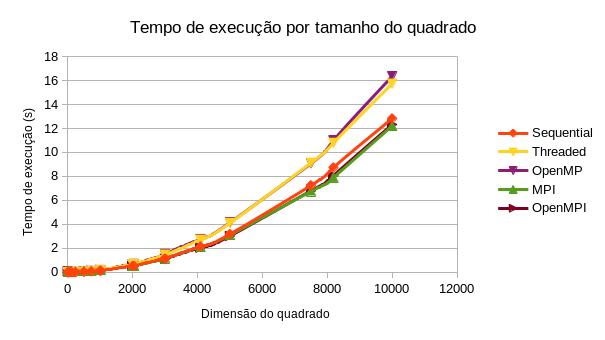
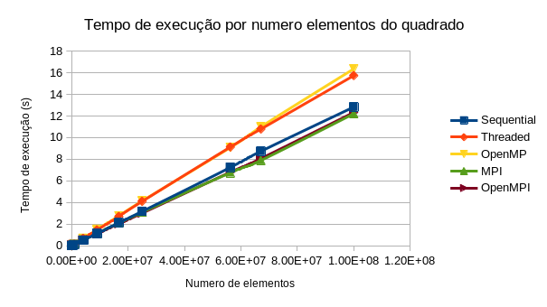

# 

# Estudo do desempenho das diferentes implementações na resolução de um problema

Guilherme Henriques | aluno nº 61018
2021

## 2021

# Conteúdo

1. [Resumo](#resumo)

2. [Abstract](#abstract)

3. [Introdução](#introdução)

4. [Enquadramento](#enquadramento)

5. [Estudo de casos](#estudo-de-casos)

6. [Análise de resultados e discussão](#análise-de-resultados-e-discussão)

7. [Comentários finais](#comentários-finais)

8. [Bibliografia](#bibliografia)

# Resumo

Este trabalho foi desenvolvido no âmbito da cadeira sistemas paralelos e distribuídos. Neste relatório serão apresentados os objetivos principais do trabalho que nos foi proposto, a metodologia seguida, as implementações feitas e os seus resultados e por fim o comentários finais.

# Abstract

This work was developed in the scope of the parallel and distributed systems course. This report will present the main objectives of the work that was proposed to us, the methodology followed, the implementations made and their results, and finally the final comments.

# Introdução

Este projeto tem como objetivo o estudo do desempenho de um conjunto de programas na linguagem C com 5 diferentes abordagens, sendo estas sequencial, threaded, OpenMP, MPI e uma abordagem híbrida do OpenMP com MPI\
A metodologia usada foi o estudo da preformance das varias implementações implementações.\
O propósito destes programas é sempre o mesmo, determinar se os dados contidos num dado ficheiro de texto correspondem a um [quadrado mágico](#quadrado-magico) e, em caso afirmativo, determinar se é quadrado mágico perfeito ou imperfeito.

Neste relatório pode encontrar:

- [Enquadramento](#enquadramento) Os conceitos fundamentais à compreensão deste relatório
- [Estudo de casos](#estudo-de-casos) A descrição do problema, alternativas criadas, implementações e recolha de dados
- [Análise de resultados e discussão](#análise-de-resultados-e-discussão) A analise critica dos resultados
- [Comentários finais](#comentários-finais) Opinião em relação aos metodos, resultados e outras notas pertinentes
- [Bibliografia](#bibliografia) Bibliografia usada no trabalho

# Enquadramento

## Thread

Uma thread é como um agente, responsavel pela execução de operações a ele atribuidas. Enquanto agente, apenas consegue fazer uma operação de cada vez.

## Implementação sequencial

A implementação sequencial é uma implementação também chamada de codigo corrído. Onde apenas uma Thread é responsável pela execução completa do código de forma sequencial.

## Implementação threaded

A implementação threaded é uma implementação cujo trabalho é dividido por várias threads que trabalham em simultãneo.

## OpenMP

O OpenMp é uma biblioteca com implementação de multithreaded para sistemas computacionais de memória partilhada. Permite ao programador selecionar as partes do codigo que são partilhadas na execução entre as varias threads.

## MPI

MPI é um modelo de programação que permite a divisão da execução do programa por várias máquinas. Permitindo a cada computador executar a parte do código que lhe for atribuida.

## Quadrado magico

Quadrado Mágico é uma tabela quadrada, com números, em que a soma de cada coluna, de cada linha e das duas diagonais são iguais.
Pode ser classificado como:

### Perfeito

Um quadrado que obedece às regras de um quadrado mágico. A soma das linhas, colunas e diagonais é igual

Exemplo:

|**8**|**1**|**6**|
|:---:|:---:|:---:|
|**3**|**5**|**7**|
|**4**|**9**|**2**|

A soma de qualquer linha, coluna ou diagonal é 15.

### Imperfeito/defeituoso

Um quadrado que obedece quase todas regras de um quadrado mágico. A soma das linhas, colunas é igual, porém pelo menos uma das diagonais difere

Exemplo:

|**1**|**2**|**3**|
|:---:|:---:|:---:|
|**2**|**3**|**1**|
|**3**|**1**|**2**|

A soma de qualquer linha ou coluna e uma das diagonais é 6 a outra diagonal é 9.

Existem mais tipos de quadrados mágicos para além dos mencionados, porém não são relevantes para este trabalho.

[Ver fonte](https://pt.wikipedia.org/wiki/Quadrado_m%C3%A1gico)

# Estudo de casos

O programa a desenvolver com as cinco implementações deve ser capaz de identificar o tipo de quadrado, que lhe é fornecido.
Os dados dos quadrados devem estar guardados em ficheiros.

Foi nos fornecido uma ferramenta para gerar quadrados mágicos, e depressa começamos a partilhar entre nós, colegas, os ficheiros de teste gerados para utilização de todos.
Os testes são compostos por uma linha única com todos os números inteiros que compõem um quadrado magico separados apenas por um espaço ```' '```. Os ficheiros mais simples são ficheiros com quadrados pequenos 3 por 3. E os mais elaborados são ficheiros de com quadrados de 20001 de lado. Estes últimos, por conterem mais dados, são maiores no espaço que ocupam no disco rígido da maquina. Pode chegar aos 3,6Gb. Por serem maiores irão, logicamente, requerer mais recursos computacionais para resolver o problema.\
Para facilitar a identificação do quadrado que o ficheiro contém foi seguida uma convenção para a nomeação do ficheiro em si, onde quadrados perfeitos começam pela letra ```p```, quadrados imperfeitos começam pela letra ```i``` e quadrados que não são mágicos começam pela letra ```n```. Precedendo a letra identificadora vem um numero inteiro com o tamanho do lado do quadrado. Por fim vem a extensão do ficheiro que será sempre ```.txt```.
Exemplo de nomes de ficheiro de teste:\
```p3.txt```\
```i7.txt```\
```n31.txt```

## Implementações

### A implementação Sequencial

A implementação sequencial foi implementada de maneira a efectuar os calculos e verificações à medida que vai lendo os dados do ficheiro.
Sempre que um numero é lido é somado ao total da linha e ao total da coluna a que pertence e, no caso de pertencer a alguma diagonal, é somado aos totais coorespondentes. Se durante este procedimento, algum total final das linhas ou colunas for diferente, o quadrado não é mágico. Se as linhas e colunas forem iguais mas alguma das diagonais diferir, o quadrado é magico imperfeito. Se todos os totais forem iguais o quadrado é mágico.

### A implementação Threaded

Na implementação threaded decidi dividir a tarefa mais demorada da sequencial, a leitura. A determinação do tipo de quadrado passou a ser executada após a leitura dos dados todos para uma lista. Dividir o trabalho de leitura por varias partes não é uma tarefa trivial. Primeiro é necessario saber quantos caracteres existem no ficheiro. Sabendo este valor podemos fazer a divisão aproximada da leitura. Ao dividirmos pelo numero de characteres podemos acidentalmente dividir os characteres de um número inteiro. Cada thread irá procurar o inicio no numero mais próximo e ler todos os numeros até que o inicio do seguinte ultrapasse o limite final.
Todos os numeros são guardados em varias listas que depois serão unidas.

### A implementação OpenMP

A implementação é apenas uma adaptação da implementação threaded, com apenas algumas diferenças notáveis. Nesta implementação todas as threads são responsáveis pela leitura, ao passo que na threaded apenas as secundárias são. Visto que a primeira é responsável pela criação e divisão dos dados pelas threads secundárias e das próprias threads.

### A implementação MPI

Esta implementação é semelhante às anteriores. Porém foi necessário a implementação de funções especificas para serem usadas pelo computador satéite para que este leia usando as funções da biblioteca MPI. Para correr a leitura é necessário que o mesmo ficheiro esteja presente nos 2 computadores.

### A implementação OpenMPI

Esta implementação é semelhante à anterior. Apenas foi dividido o trabalho de cada maquina por 2 threads, usando a biblioteca OpenMPI.

## Instruções

Apenas estão incluídos alguns ficheiros de teste, não foi possível incluir os restantes devido ao limite de 100Mb do github.
Para o resto dos test files clicar [aqui](https://mega.nz/file/Cc8lnYaS#bikjsB_99M4HY81XMtz3itC8jDUnwN8ruZFvVP2_rxM).\
Extrair o conteúdo do ficheiro comprimido para o diretório ```/tests```

Abrir terminal no diretório do projeto

- Compilar e executar - correr o seguinte commando:

```bash
# Sequential
./sequential/run.sh tests/<test-file>

# Threaded
./threaded/run.sh tests/<test-file> <thread-count>

# OpenMP
./openMP/run.sh tests/<test-file>

# MPI
./MPI/run.sh tests/<test-file>

# OpenMPI
./openMPI/run.sh tests/<test-file>
```

O programa irá compilar e correr com o ficheiro de teste fornecido.

- Compilar apenas:

```bash
# Sequential
./sequential/compile.sh

# Threaded
./threaded/compile.sh

# OpenMP
./openMP/compile.sh

# MPI
./MPI/compile.sh

# OpenMPI
./openMPI/compile.sh
```

- Executar apenas:

```bash
# Sequential
./sequential/a.out tests/<test-file>

# Threaded
./threaded/a.out tests/<test-file> <thread-count>

# OpenMP
./openMP/a.out tests/<test-file>

# MPI
./MPI/mpirun -np 2 ./a.out tests/<test-file>

# OpenMPI
./openMPI/mpirun -np 2 ./a.out tests/<test-file>
```

## Recolha de resultados

Como forma de mensurar a performance dos programas desenvolvidos irei utilizar os scripts de benchmark criados por mim e partilhados com os meus colegas.
Estes scripts tem por base a utilização do programa ```time``` presente no kernel. Esta função informa-nos sobre o tempo que um dado programa leva desde que começa a sua execução até que termina.\
O script irá correr o programa 31 vezes onde apenas a primeira não é contabilizada. Os resultados são devolvidos num ficheiro de texto com os tempos das 30 execuções e serão depois usados para calcular a media. Para analisar estes dados e calcular a media de forma mais conveniente criei um programa e em linguagem C ao qual é fornecido o ficheiro com os tempos e ele devolve a media dos tempos no stdout. Este programa foi também partilhado com os meus colegas.

## Análise de resultados e discussão

### Tabela - Tempo de execução por tamanho do quadrado

| Quadrado | Sequential | Threaded  | OpenMP    | MPI       | OpenMPI  |
| -------- | ---------- | --------- | --------- | --------- | -------- |
| 3        | 0.007367   | 0.008467  | 0.009     | 0.081767  | 0.0739   |
| 4        | 0.007333   | 0.008233  | 0.008933  | 0.083433  | 0.0742   |
| 5        | 0.0076     | 0.008567  | 0.011067  | 0.096967  | 0.072467 |
| 6        | 0.007567   | 0.008467  | 0.01      | 0.0787    | 0.0731   |
| 7        | 0.007333   | 0.0088    | 0.0088    | 0.073767  | 0.072267 |
| 8        | 0.007333   | 0.009033  | 0.0089    | 0.070267  | 0.075433 |
| 9        | 0.007267   | 0.009033  | 0.008867  | 0.070633  | 0.0727   |
| 10       | 0.0072     | 0.0096    | 0.008967  | 0.072567  | 0.075333 |
| 11       | 0.007367   | 0.008733  | 0.008733  | 0.0825    | 0.072667 |
| 15       | 0.0076     | 0.008633  | 0.008967  | 0.0744    | 0.072467 |
| 16       | 0.0072     | 0.0088    | 0.009067  | 0.077367  | 0.072567 |
| 30       | 0.007833   | 0.0088    | 0.0092    | 0.082667  | 0.073733 |
| 31       | 0.007233   | 0.008467  | 0.0092    | 0.0769    | 0.073167 |
| 51       | 0.0076     | 0.009033  | 0.0106    | 0.1266    | 0.075    |
| 63       | 0.007833   | 0.0086    | 0.0112    | 0.0789    | 0.0736   |
| 101      | 0.008567   | 0.0093    | 0.010967  | 0.071833  | 0.0811   |
| 127      | 0.0094     | 0.009767  | 0.011333  | 0.080233  | 0.076367 |
| 243      | 0.014767   | 0.0182    | 0.018767  | 0.085367  | 0.082367 |
| 255      | 0.015933   | 0.019367  | 0.0189    | 0.085333  | 0.080433 |
| 501      | 0.038167   | 0.0491    | 0.049067  | 0.113667  | 0.102667 |
| 511      | 0.038867   | 0.050433  | 0.050167  | 0.1266    | 0.103433 |
| 729      | 0.073033   | 0.093667  | 0.106067  | 0.1338    | 0.135033 |
| 1001     | 0.128433   | 0.1567    | 0.173967  | 0.1864    | 0.203467 |
| 1023     | 0.132933   | 0.165833  | 0.1835    | 0.185667  | 0.1904   |
| 2000     | 0.512933   | 0.660533  | 0.6757    | 0.527367  | 0.540367 |
| 2001     | 0.502867   | 0.6469    | 0.690867  | 0.546867  | 0.5359   |
| 2047     | 0.528      | 0.678067  | 0.696067  | 0.5542    | 0.5593   |
| 3000     | 1.139333   | 1.468433  | 1.437533  | 1.160267  | 1.127433 |
| 3001     | 1.124467   | 1.477467  | 1.522467  | 1.144267  | 1.1071   |
| 4095     | 2.146267   | 2.7137    | 2.765067  | 2.1251    | 2.0493   |
| 5001     | 3.186133   | 4.111167  | 4.142967  | 3.107     | 3.024733 |
| 7501     | 7.2493     | 9.132767  | 9.0879    | 6.754033  | 6.801367 |
| 8191     | 8.7369     | 10.792967 | 10.992367 | 7.894767  | 8.064167 |
| 10001    | 12.827     | 15.731767 | 16.352133 | 12.210433 | 12.3279  |



### Tabela - Tempo de execução por numero elementos do quadrado

| Elementos | Sequential | Threaded  | OpenMP    | MPI       | OpenMPI  |
| --------- | ---------- | --------- | --------- | --------- | -------- |
| 9         | 0.007367   | 0.008467  | 0.009     | 0.081767  | 0.0739   |
| 16        | 0.007333   | 0.008233  | 0.008933  | 0.083433  | 0.0742   |
| 25        | 0.0076     | 0.008567  | 0.011067  | 0.096967  | 0.072467 |
| 36        | 0.007567   | 0.008467  | 0.01      | 0.0787    | 0.0731   |
| 49        | 0.007333   | 0.0088    | 0.0088    | 0.073767  | 0.072267 |
| 64        | 0.007333   | 0.009033  | 0.0089    | 0.070267  | 0.075433 |
| 81        | 0.007267   | 0.009033  | 0.008867  | 0.070633  | 0.0727   |
| 100       | 0.0072     | 0.0096    | 0.008967  | 0.072567  | 0.075333 |
| 121       | 0.007367   | 0.008733  | 0.008733  | 0.0825    | 0.072667 |
| 225       | 0.0076     | 0.008633  | 0.008967  | 0.0744    | 0.072467 |
| 256       | 0.0072     | 0.0088    | 0.009067  | 0.077367  | 0.072567 |
| 900       | 0.007833   | 0.0088    | 0.0092    | 0.082667  | 0.073733 |
| 961       | 0.007233   | 0.008467  | 0.0092    | 0.0769    | 0.073167 |
| 2601      | 0.0076     | 0.009033  | 0.0106    | 0.1266    | 0.075    |
| 3969      | 0.007833   | 0.0086    | 0.0112    | 0.0789    | 0.0736   |
| 10201     | 0.008567   | 0.0093    | 0.010967  | 0.071833  | 0.0811   |
| 16129     | 0.0094     | 0.009767  | 0.011333  | 0.080233  | 0.076367 |
| 59049     | 0.014767   | 0.0182    | 0.018767  | 0.085367  | 0.082367 |
| 65025     | 0.015933   | 0.019367  | 0.0189    | 0.085333  | 0.080433 |
| 251001    | 0.038167   | 0.0491    | 0.049067  | 0.113667  | 0.102667 |
| 261121    | 0.038867   | 0.050433  | 0.050167  | 0.1266    | 0.103433 |
| 531441    | 0.073033   | 0.093667  | 0.106067  | 0.1338    | 0.135033 |
| 1002001   | 0.128433   | 0.1567    | 0.173967  | 0.1864    | 0.203467 |
| 1046529   | 0.132933   | 0.165833  | 0.1835    | 0.185667  | 0.1904   |
| 4000000   | 0.512933   | 0.660533  | 0.6757    | 0.527367  | 0.540367 |
| 4004001   | 0.502867   | 0.6469    | 0.690867  | 0.546867  | 0.5359   |
| 4190209   | 0.528      | 0.678067  | 0.696067  | 0.5542    | 0.5593   |
| 9000000   | 1.139333   | 1.468433  | 1.437533  | 1.160267  | 1.127433 |
| 9006001   | 1.124467   | 1.477467  | 1.522467  | 1.144267  | 1.1071   |
| 16769025  | 2.146267   | 2.7137    | 2.765067  | 2.1251    | 2.0493   |
| 25010001  | 3.186133   | 4.111167  | 4.142967  | 3.107     | 3.024733 |
| 56265001  | 7.2493     | 9.132767  | 9.0879    | 6.754033  | 6.801367 |
| 67092481  | 8.7369     | 10.792967 | 10.992367 | 7.894767  | 8.064167 |
| 100020001 | 12.827     | 15.731767 | 16.352133 | 12.210433 | 12.3279  |



Ao olharmos para o gráfico podemos reparar que este assemelha-se a uma reta, para cada implementação.
Podemos também observar que a implementação mais eficiente, por uma margem minuscula, é no meu caso é a MPI.
As retas re regressão linear, por ordem de delive, são as seguintes:

```MATH
OpenMPI   : y = 8.00E-08 x
Sequential: y = 1.28E-07 x
Threaded  : y = 1.59E-07 x
MPI       : y = 1.70E-07 x
OpenMP    : y = 2.32E-07 x
```

### Tabela - Tempo de medio de execução por elemento

| Elementos | Sequential           | Threaded             | OpenMP               | MPI                  | OpenMPI              |
| --------- | -------------------- | -------------------- | -------------------- | -------------------- | -------------------- |
| 9         | 0.000818555555556    | 0.000940777777778    | 0.001                | 0.009085222222222    | 0.008211111111111    |
| 16        | 0.0004583125         | 0.0005145625         | 0.0005583125         | 0.0052145625         | 0.0046375            |
| 25        | 0.000304             | 0.00034268           | 0.00044268           | 0.00387868           | 0.00289868           |
| 36        | 0.000210194444444    | 0.000235194444444    | 0.000277777777778    | 0.002186111111111    | 0.002030555555556    |
| 49        | 0.000149653061224    | 0.000179591836735    | 0.000179591836735    | 0.001505448979592    | 0.001474836734694    |
| 64        | 0.000114578125       | 0.000141140625       | 0.0001390625         | 0.001097921875       | 0.001178640625       |
| 81        | 8.9716049382716E-05  | 0.000111518518519    | 0.000109469135802    | 0.000872012345679    | 0.000897530864198    |
| 100       | 7.2E-05              | 9.6E-05              | 8.967E-05            | 0.00072567           | 0.00075333           |
| 121       | 6.08842975206612E-05 | 7.21735537190083E-05 | 7.21735537190083E-05 | 0.000681818181818    | 0.000600553719008    |
| 225       | 3.37777777777778E-05 | 3.83688888888889E-05 | 3.98533333333333E-05 | 0.000330666666667    | 0.000322075555556    |
| 256       | 2.8125E-05           | 3.4375E-05           | 3.541796875E-05      | 0.00030221484375     | 0.00028346484375     |
| 900       | 8.70333333333333E-06 | 9.77777777777778E-06 | 1.02222222222222E-05 | 9.18522222222222E-05 | 8.19255555555556E-05 |
| 961       | 7.52653485952133E-06 | 8.81061394380853E-06 | 9.57336108220604E-06 | 8.00208116545265E-05 | 7.61363163371488E-05 |
| 2601      | 2.92195309496348E-06 | 3.47289504036909E-06 | 4.07535563244906E-06 | 4.86735870818916E-05 | 2.88350634371396E-05 |
| 3969      | 1.97354497354497E-06 | 2.16679264298312E-06 | 2.82186948853616E-06 | 1.98790627362056E-05 | 1.8543713781809E-05  |
| 10201     | 8.39819625526909E-07 | 9.11675325948436E-07 | 1.07509067738457E-06 | 7.04176061170474E-06 | 7.95020096069013E-06 |
| 16129     | 5.82801165602331E-07 | 6.05555211110422E-07 | 7.02647405294811E-07 | 4.9744559489119E-06  | 4.73476346952694E-06 |
| 59049     | 2.5008044166709E-07  | 3.08218598113431E-07 | 3.17820792900811E-07 | 1.44569764094227E-06 | 1.39489237751698E-06 |
| 65025     | 2.45028835063437E-07 | 2.97839292579777E-07 | 2.90657439446367E-07 | 1.3123106497501E-06  | 1.23695501730104E-06 |
| 251001    | 1.52059155142808E-07 | 1.95616750530874E-07 | 1.95485276951088E-07 | 4.5285476950291E-07  | 4.09030242907399E-07 |
| 261121    | 1.48846703252515E-07 | 1.93140344897576E-07 | 1.92121660073299E-07 | 4.84832702080645E-07 | 3.96111381313644E-07 |
| 531441    | 1.37424474212565E-07 | 1.76250985528027E-07 | 1.99583773175197E-07 | 2.51768305418664E-07 | 2.54088412448419E-07 |
| 1002001   | 1.28176518785909E-07 | 1.56387069473983E-07 | 1.73619587206001E-07 | 1.86027758455331E-07 | 2.03060675588148E-07 |
| 1046529   | 1.27022758088882E-07 | 1.58460014008212E-07 | 1.75341533774984E-07 | 1.77412188291008E-07 | 1.81934757660801E-07 |
| 4000000   | 1.2823325E-07        | 1.6513325E-07        | 1.68925E-07          | 1.3184175E-07        | 1.3509175E-07        |
| 4004001   | 1.25591127474743E-07 | 1.61563396212938E-07 | 1.72544162701258E-07 | 1.36580135719247E-07 | 1.33841125414304E-07 |
| 4190209   | 1.26008034444105E-07 | 1.61821761157976E-07 | 1.66117489604934E-07 | 1.32260705850233E-07 | 1.33477828910205E-07 |
| 9000000   | 1.26592555555556E-07 | 1.63159222222222E-07 | 1.59725888888889E-07 | 1.28918555555556E-07 | 1.25270333333333E-07 |
| 9006001   | 1.2485752555435E-07  | 1.6405361269669E-07  | 1.69050281029283E-07 | 1.27056059620691E-07 | 1.22929144689191E-07 |
| 16769025  | 1.27989969601691E-07 | 1.61828132524103E-07 | 1.64891339836395E-07 | 1.26727701819277E-07 | 1.22207462866804E-07 |
| 25010001  | 1.27394357161361E-07 | 1.64380921056341E-07 | 1.6565241240894E-07  | 1.24230302909624E-07 | 1.20940938786848E-07 |
| 56265001  | 1.28842084264781E-07 | 1.62317014799307E-07 | 1.61519591904033E-07 | 1.20039685061056E-07 | 1.20880954041039E-07 |
| 67092481  | 1.30221745712459E-07 | 1.60867012802821E-07 | 1.63839029890697E-07 | 1.17669921909729E-07 | 1.20194795002439E-07 |
| 100020001 | 1.28244349847587E-07 | 1.57286211184901E-07 | 1.63488630638986E-07 | 1.22079912796642E-07 | 1.23254347897877E-07 |
| \---      | \---                 | \---                 | \---                 | \---                 | \---                 |
| Media     | 4.16440803634711E-07 | 4.56886904611927E-07 | 5.10234099097811E-07 | 3.21007679492708E-06 | 3.06482792352196E-06 |

Se compararmos as medias de execução por elemento podemos determinar que o algoritmo mais eficiente foi o Sequencial. Pois foi o que levou, em media, menos tempo para cada elemento. Porém não considero estes dados muito conclusivos, pois os tempos para os quadrados mais pequenos são altamente afetados pela precisão do programa ```time```.\
Outro elemento que leva a esta discrepancia é o facto de os programas que usam MPI demoram um pouco mais a abrir. Devido ao tempo que demora para fazer a ligação entre os dois computadores.

## Comentários finais

Penso que atinji o objetivo deste projeto. Tive apenas alguns problemas na a ligação com o computador da universidade, onde era suposto correr os programas MPI e OpenMPI, pelo que tive de correr estes problemas localmente. Isto influenciou os dados de forma a beneficiar ambas as implementações.

Creio que este problema não seja o melhor para avaliar a diferença entre diferentes metodos de implementação. Isto porque o que mais influenciava o tempo de execução do programa era a a leitura dos dados e não a determinação do tipo de quadrado. Notei que a leitura demorava mais de 95% do tempo necessário para a execução. Pois bem a leitura, por muito que tentemos optimizar tem um limite na sua velocidade. Este limite é totalmente limitado pelo hardware, pela velocidade de leitura do disco rigido. Todas as soluções são tão fortes quanto a sua maior fraqueza.

# Bibliografia

- [Quadrado mágico in wikipedia.org](https://pt.wikipedia.org/wiki/Quadrado_m%C3%A1gico)

- [Pthreads in cs.cmu.edu](https://www.cs.cmu.edu/afs/cs/academic/class/15492-f07/www/pthreads.html)

- [Pthreads in wikipedia.org](https://en.wikipedia.org/wiki/POSIX_Threads)

- [OpenMP in hpc.llnl.gov](https://hpc.llnl.gov/openmp-tutorial)

- [OpenMP in bowdoin.edu](http://www.bowdoin.edu/~ltoma/teaching/cs3225-GIS/fall17/Lectures/openmp.html)

- [OpenMP in wikipedia.org](https://pt.wikipedia.org/wiki/OpenMP)

- [MPI in mpitutorial.com](https://mpitutorial.com/tutorials/)

- [MPI in youtube.com](https://www.youtube.com/watch?v=E-fD6A8rFZk)

- [OpenMPI in open-mpi.org](https://www.open-mpi.org/)
